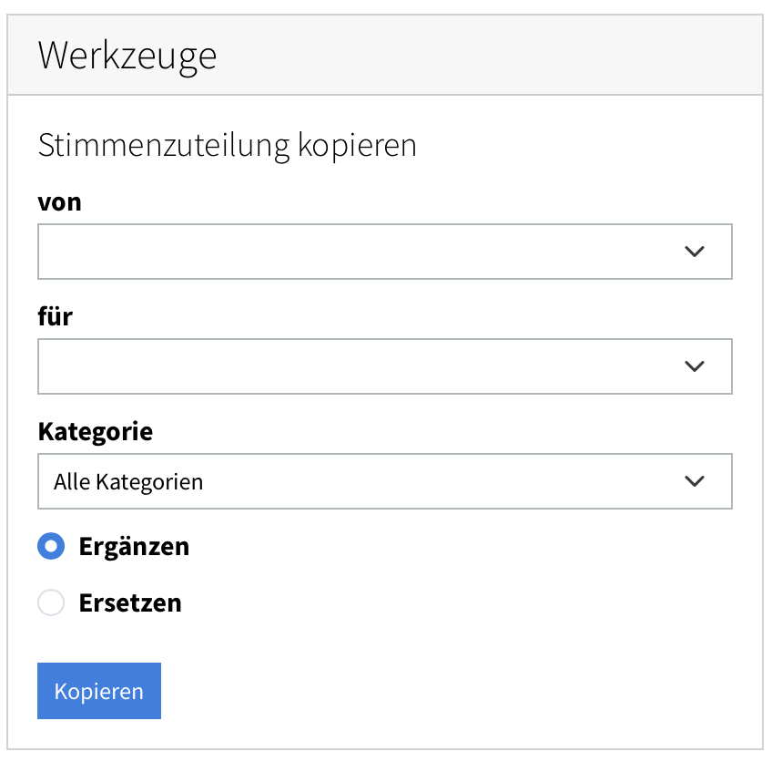

[Home](/) > [Notenverwaltung](/noten) >

# Stimmen kopieren

Damit du eine ähnliche Zuteilung nicht für jedes Mitglied neu klicken musst, lässt sich die **komplette Stimmen-Zuteilung eines Mitglieds auf ein anderes kopieren** – praktisch, wenn z.B. eine neue Person dieselben Stimmen wie ein bestehendes Mitglied übernimmt.

Die Funktion findest du auf der **Notenverwaltungs-Startseite** («Noten» → «Administration») rechts im Bereich **«Werkzeuge»**:

1. Wähle in der ersten Namens-Liste das Mitglied, **von** dem kopiert werden soll.
2. Wähle in der zweiten Liste das Mitglied, **zu** dem kopiert werden soll.
3. Wähle bei **Kategorie** entweder **«Alle Kategorien»** oder eine bestimmte Kategorie, wenn du nur deren Stücke kopieren möchtest (siehe unten).
4. Wähle, ob die bestehende Zuteilung des Zielmitglieds **ergänzt** oder **ersetzt** werden soll (siehe unten).
5. Klicke auf **«Kopieren»**.

!!! info "Nur eine Kategorie kopieren"
    Standardmässig werden die Stimmen **aller** Stücke kopiert. Wählst du eine bestimmte **Kategorie**, betrifft das Kopieren nur deren Stücke. In Kombination mit **«Ersetzen»** wird dann auch nur **innerhalb dieser Kategorie** ersetzt – Zuteilungen des Zielmitglieds in anderen Kategorien bleiben unverändert.

!!! info "Ergänzen oder Ersetzen?"
    - **Ergänzen** (Standard): Die Stimmen des Quell-Mitglieds kommen **zu** den bereits vorhandenen Zuteilungen des Zielmitglieds dazu. Nichts geht verloren; schon identische Zuteilungen werden einfach übersprungen.
    - **Ersetzen**: Die bisherigen Zuteilungen des Zielmitglieds werden **zuerst gelöscht** (bei gewählter Kategorie nur dort), danach werden die des Quell-Mitglieds gesetzt. bin-dabei fragt vor dem Ersetzen zur Sicherheit nach.

!!! tip "Zuteilung eines anderen Mitglieds ansehen"
    Auf der **Noten-Seite eines Mitglieds** kannst du als Admin über das **Namens-Dropdown** zur Ansicht eines anderen Mitglieds wechseln – praktisch, um vor oder nach dem Kopieren zu prüfen, wer welche Stimmen zugeteilt hat.
