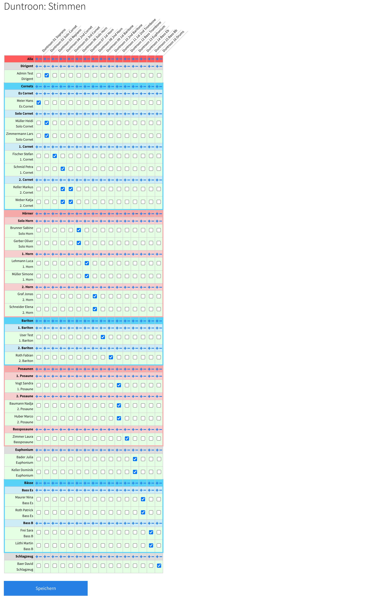

[Home](/) > [Notenverwaltung](/noten) >

# Stimmen zuteilen

Wenn die [Stimmen-PDFs eines Stücks](/noten/stuecke) im Online-Speicher liegen, weist du sie hier den Mitgliedern zu. Klicke beim Stück (in der [Stück-Liste](/noten/stuecke) oder der Kategorie-Spalte) auf **«Stimmen»**.

!!! note "Voraussetzung: Register & Instrumente"
    Die Mitglieder werden in der Zuteilungs-Matrix anhand ihres **Registers** und **Instruments** gruppiert und sortiert. Lege darum vorher die [Register & Instrumente](/admin/register-instrumente) deines Vereins an und hinterlege bei jedem Mitglied das passende Instrument.

## Die Zuteilungs-Matrix

Du siehst eine Tabelle: **oben** die einzelnen Stimmen-PDFs des Stücks (eine Spalte pro Datei), **links** die Mitglieder, nach **Register** gruppiert und sortiert (daher lohnt sich das saubere Einrichten von [Registern & Instrumenten](/admin/register-instrumente)). In den Kreuzungspunkten setzt du das Häkchen, wenn ein Mitglied diese Stimme erhalten soll.

So geht das Zuweisen schnell:

- **Einzeln:** Häkchen direkt beim Mitglied und der gewünschten Stimme setzen.
- **Pro Instrument / Register:** Mit den **`+`**- und **`–`**-Tasten weist du eine Stimme allen Mitgliedern eines Instruments bzw. Registers auf einmal zu (oder entfernst sie wieder).
- **Allen:** In der Zeile **«Alle»** weist du eine Stimme mit **`+`** sämtlichen Mitgliedern zu, mit **`–`** nimmst du sie allen weg.

Zum Schluss mit **«Speichern»** sichern. Jedes Mitglied sieht danach genau die zugeteilten Stimmen auf seiner [Noten-Seite](/user/noten).

!!! tip
    In der Regel weist du eine Stimme einem ganzen **Instrument** zu – z.B. die Datei «Klarinette 1» allen Mitgliedern mit dem Instrument «Klarinette 1». Mit der **Register**-Zuweisung triffst du dagegen alle eines Registers auf einmal (z.B. alle «Klarinetten»). Für Spezialfälle (eine Aushilfe, eine geteilte Stimme) korrigierst du danach einzelne Häkchen.

!!! tip "Zuteilung von Mitglied zu Mitglied kopieren"
    Übernimmt eine neue Person dieselben Stimmen wie ein bestehendes Mitglied, musst du sie nicht neu klicken – du kannst die ganze Zuteilung [von Mitglied zu Mitglied kopieren](/noten/stimmen-kopieren).

## Automatischer Vorschlag

!!! note "Voraussetzung: saubere Instrumente & Dateinamen"
    Der Vorschlag ist nur so gut wie die hinterlegten [Instrumente](/admin/register-instrumente) und die Benennung der Stimmen-Dateien. Je genauer beides dem Schema entspricht, desto treffsicherer die Zuteilung.

Der Zuteilungsvorschlag ist Teil des **Noten-KI-Pakets** (zusammen mit der [Stimmenaufteilung](/noten/stimmenaufteilung)) und wird auf Wunsch freigeschaltet – melde dich, wenn du das Paket nutzen möchtest.

Ist er für deinen Verein aktiv, erscheint über der Tabelle der Knopf **«Verteilung vorschlagen»**. Er belegt die Matrix automatisch vor – jede Stimme wird den passenden Mitgliedern zugeordnet:

- **Instrument & Stimmen-Nummer:** «Klarinette 1» geht an die 1. Klarinetten, «Klarinette 2» an die 2., eine kombinierte Datei «Klarinette 1+2» an beide. Trägt ein Mitglied keine Nummer (Instrument nur «Klarinette»), bekommt es alle Klarinetten-Stimmen – und umgekehrt bekommt eine unnummerierte Datei alle Klarinettist:innen.
- **Kombinierte Instrumente:** Nennt eine Datei zwei Instrumente (z.B. «Piccolo+Querflöte» oder «Oboe/Englischhorn»), wird sie **beiden** Registern vorgeschlagen.
- **Schlüssel (T.C. / B.C.):** Ist ein Mitglied auf einen Schlüssel eingestellt (z.B. Instrument «Posaune BC»), erhält es nur diese Variante; ohne Angabe werden **beide** Varianten vorgeschlagen.
- **Sinnvoller Ersatz:** Hat der Verein kein eigenes Cornet/Flügelhorn, gehen diese Stimmen an die **Trompeten**; fehlt das Tenorhorn, an die **Euphonien**; fehlen eigene Pauken-/Mallets-Spieler:innen, an die **Perkussion**. Gibt es eigene Spieler:innen dafür, bleibt es bei ihnen.
- **Partitur:** Die Partitur geht an die **Dirigent:in**.
- **Nicht erkannte Dateien** werden nicht automatisch zugeteilt – die setzt du von Hand.
- **Brass Band:** Funktioniert auch für Brass-Band-Besetzungen (Soprano/Solo/Repiano/2nd/3rd Cornet, Hörner, Baritone, Posaunen, Bässe) und erkennt die üblichen Kurzbezeichnungen in den Dateinamen (z.B. «Sop», «SoloCrn», «Flgh», «BassTrbn»). Kombinierte Stimmen wie «1st & 2nd Cornet» oder «Baritone 1&2» werden **beiden** Registern vorgeschlagen. Voraussetzung ist das Brass-Band-Benennungsprofil des Vereins.

Der Vorschlag ist **nicht bindend**: Prüfe ihn, korrigiere einzelne Häkchen und **speichere** wie gewohnt. Sind schon Häkchen gesetzt, fragt bin-dabei, ob du sie **ersetzen** oder den Vorschlag **ergänzen** willst.
