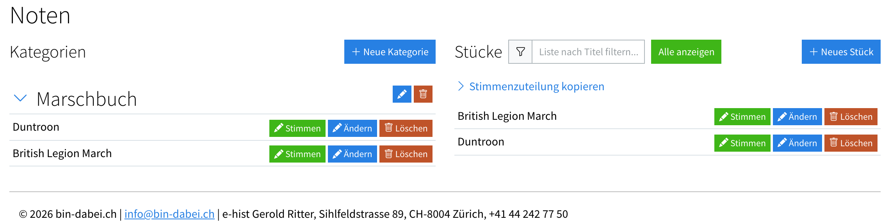
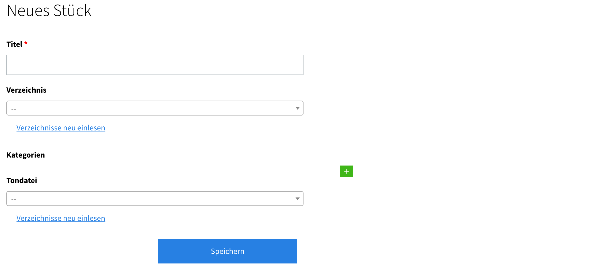

[Home](/) > [Notenverwaltung](/noten) >

# Stücke & Kategorien

Das Repertoire deines Vereins verwaltest du unter **«Noten» → «Administration»**. Die Seite ist zweispaltig: links die **Kategorien**, rechts die **Stücke**.

## Kategorien

Mit Kategorien ordnest du dein Repertoire (z.B. «Marschmusik», «Konzertstücke», «Unterhaltung»). So behältst du bei vielen Stücken den Überblick, und die Mitglieder finden ihre Noten schneller.

- Mit **«Neue Kategorie»** legst du eine Kategorie an.
- Über das Stift-Symbol bearbeitest du sie, mit dem Papierkorb löschst du sie.
- In der Kategorie-Spalte sind die zugehörigen Stücke aufgeklappt und lassen sich **direkt dort** über **«Stimmen»**, **«Ändern»** und **«Löschen»** bearbeiten – gleich wie in der Stück-Liste rechts. Nach dem Speichern springt die Liste an die Stelle zurück, von der aus du gestartet bist.

## Stücke

In der rechten Spalte siehst du alle Stücke deines Vereins.

- Mit **«Neues Stück»** erfasst du ein Stück. Dabei gibst du an:
    - **Titel** des Stücks
    - **Verzeichnis** (der Ordner im [Online-Speicher](/noten/einrichten), in dem die Stimmen-PDFs liegen)
    - **Kategorie** (in welche Schublade das Stück gehört)
    - optional ein **Hörbeispiel** (Audiodatei), das die Mitglieder anhören können
- Über **«Ändern»** passt du diese Angaben später an, über **«Löschen»** entfernst du das Stück.
- Mit **«Stimmen»** gelangst du zur [Zuteilung der Stimmen](/noten/stimmen-zuteilen) für dieses Stück.

## Die Stimmen-PDFs des Stücks

Die eigentlichen Noten liegen im [Online-Speicher](/noten/einrichten): Pro Stück gibt es einen **Ordner**, in dem **je eine PDF-Datei pro Einzelstimme** liegt (z.B. `04_Beispielstueck_Klarinette_1.pdf`, `04_Beispielstueck_Klarinette_2.pdf`, …). Genau diese Dateien erscheinen später auf der [Stimmen-Zuteilungsseite](/noten/stimmen-zuteilen) als Spalten.

!!! warning "Sammel-PDF zuerst aufteilen"
    Gekaufte Stücke kommen meist als **ein einziges Sammel-PDF** (Partitur + alle Stimmen in einer Datei). bin-dabei braucht aber **eine separate PDF-Datei pro Einzelstimme**. Du musst das Sammel-PDF also zuerst in die einzelnen Stimmen **aufteilen** – entweder von Hand (z.B. mit einem PDF-Programm) oder automatisch mit der [Stimmenaufteilung](/noten/stimmenaufteilung). Die entstandenen Einzelstimmen-PDFs legst du anschliessend in den Ordner des Stücks im Online-Speicher.

Sind die Stimmen-PDFs im Ordner, geht es weiter mit dem [Zuteilen](/noten/stimmen-zuteilen).
